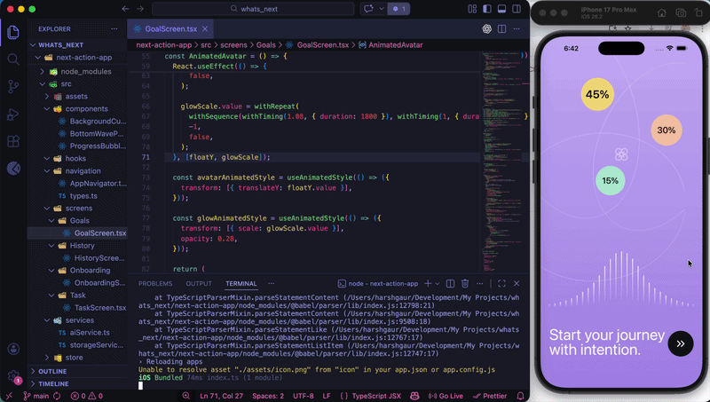
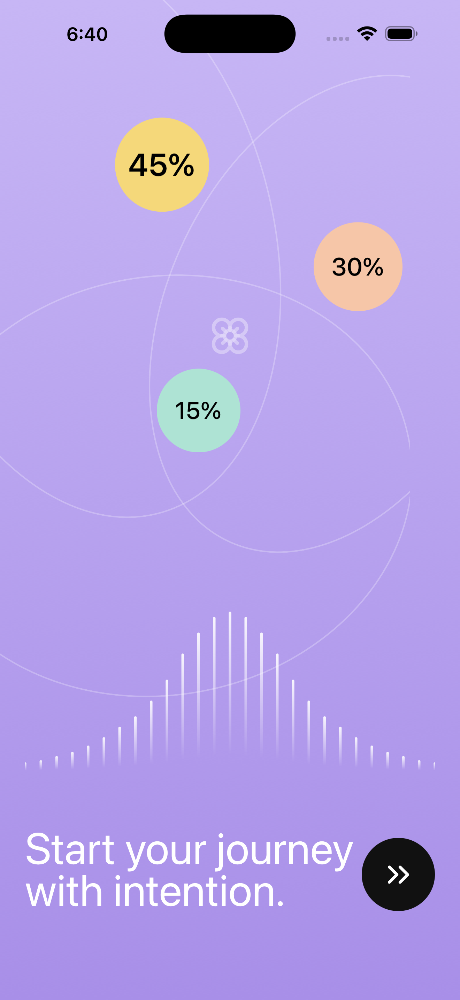

# 🚀 **WhatsNext — Your AI-Powered Action Generator**

> Stop overthinking. Start doing.

**WhatsNext** is a minimal productivity app that solves one real problem:

**“What should I do next?”**

Instead of overwhelming you with tasks, it gives you exactly ONE actionable step based on your goal and available time.

**✨ Features**

**🎯 Goal-Based Planning**

Add and manage multiple goals (e.g., Learn React Native, Fitness, DSA)

**⏱ Time-Aware Suggestions**

Select how much time you have (15 min, 30 min, 1 hour…)

**🤖 AI-Powered Next Action**

Generates a single clear task using AI (Gemini)

**✅ Execution-Focused UX**

No clutter. Just one thing to do right now

**📜 History Tracking**

See what you’ve completed over time


**📱 App Screens**

**1️⃣ Onboarding & Goals**

Add and manage goals

Select one goal to focus

**2️⃣ Time Selection**

Choose available time

**3️⃣ Next Action (Core Feature)**

AI generates a task like:

“Build a reusable button component in React Native”

**4️⃣ History**

Track completed tasks


🎥 Demo



**📸 Screenshots**

🏁 Onboarding

🎯 Goals

⚡ Task Generation

📜 History


**🛠 Tech Stack**

**Frontend**

React Native (Expo)

**Storage**

AsyncStorage

**AI Integration**

Gemini API

**Optional (Future)**

Node.js + PostgreSQL

**🧠 How It Works**
User selects a goal
User selects available time
**AI receives:**
Goal: Learn React Native
Time: 30 minutes
**AI returns:**
Build a small login UI screen using React Native.
User completes → saved to history

**📂 Project Structure**
```
src/

screens/
  OnboardingScreen.tsx
  GoalsScreen.tsx
  TaskScreen.tsx
  HistoryScreen.tsx

components/
  GoalInput.tsx
  TimeButton.tsx
  TaskCard.tsx

services/
  aiService.ts
  storageService.ts

utils/
  prompts.ts
```

**⚙️ Setup & Installation**
1. Clone the repo
`git clone https://github.com/your-username/whats-next.git`
cd whats-next
3. Install dependencies
npm install
4. Add environment variables

**Create a .env file:**

`EXPO_PUBLIC_GEMINI_API_KEY=your_api_key_here`

4. Run the app
`npx expo start`
📦 Build APK (for sharing)
`npx expo run:android`

or

`npx expo export`
🚧 Future Improvements
🧠 Smart goal prioritization
📅 Calendar integration
🔥 Streak system
💬 AI productivity coach
☁️ Cloud sync


**💡 Why This Project?**

This project demonstrates:

✅ Real-world problem solving
✅ AI integration
✅ Clean UX thinking
✅ Product mindset
✅ End-to-end development
🌍 Make It Public & Stand Out

MIT License — feel free to use and modify.

**👨‍💻 Author**

Harsh Gaur
GitHub: https://github.com/HarshGaur017

**⭐ Support**

If you like this project, give it a ⭐ on GitHub!
